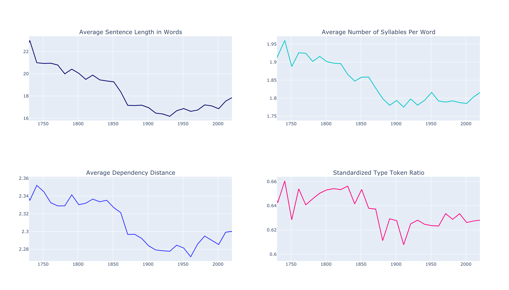

# Stylometric Analysis of Project Gutenberg

## Summary

My goal for this project was to build a recommendation engine for books that is based on author style as opposed to bibliographic metadata or reader reviews, as is the case with many other book recommenders. I also sought to cluster all English books in Project Gutenberg into stylistic types. I did this by engineering numerical style metrics for the full text of every English book in Project Gutenberg, approximately 30,000 titles. 

Based on the style metrics, I produced two things:

1. A recommendation engine using cosine similarity between titles
2. An identification of 7 stylistic types in Project Gutenberg using k-means clustering

## Project Gutenberg

Project Gutenberg is a volunteer effort to digitize and archive cultural works, to "encourage the creation and distribution of eBooks.” It was founded in 1971 by American writer Michael S. Hart and is the oldest digital library. Most of the items in its collection are the full texts of public domain books. A majority of the titles were originally published before 1950, as these titles do not fall under copyright protections.

For more information on Project Gutenberg, see [gutenberg.org/](https://www.gutenberg.org/).

## ETL Pipeline

## Style Metrics

I engineered 16 style metrics indicative of vocabulary richness, lexical complexity, sentence and word length, part-of-speech ratios, and readibility scores:

**Standardized Type-Token Ratio:** Type-token ratio (TTR) is a measure of vocabulary richness. It is calculated by dividing the number of unique tokens used in a text by the total number of tokens. _Standardized_ TTR calculates the running average of TTRs for every 1,000 word window of a document.

**Hapax Legomenon:** This measure is somewhat correlated with the TTR. It measures the percentage of words used only once. I calculated the running average for every 1,000 word window of each document. 

**Yule’s K Characteristic:** Yule's K measures the likeihood that two words randomly chosen from the same document will be the same word. 

**Function Words:** This metric is the percentage of a document comprised of function words, including articles, prepositions, and conjunctions. 

**Average Sentence Length in Words:** Including stop words, the average sentence length of a document in word count.

**Average Sentence Length in Characters:** Including stop words, the average sentence length of a document in character count.

**Average Number of Syllables Per Word:** Determined via a function that, where available, references the CMU Pronouncing Dictionary for the number of syllables in a word. When not available, the function calculates the number of syllables according to the so-called "written method." I then took the average number of syllables for the whole document. 

**Punctuation Per Sentence:** Counts the number of punctuation characters in a sentence, then takes the average number per sentence for a document. 

**Shannon’s Entropy:** Shannon's Entropy score as a general measure of diversity and readibility. 

**Simpson’s D:** Simpson's Diversity Index as a general measure of diversity and readability.
 
**Number of Noun Phrases:** Calculates the running average number of noun phrases for each 1,000 word window of a document. 

**Noun to Verb Ratio:** N(nouns)/(N(nouns + N(verbs)); Over .50 indicates noun bias, under .50 indicates verb bias. 

**Noun to Adjective Ratio:** N(nouns)/(N(nouns + N(adjectives)); Over .50 indicates noun bias, under .50 indicates adjective bias. 

**Verb to Adverb Ratio:** N(verbs)/(N(verbs + N(adverbs)); Over .50 indicates verb bias, under .50 indicates adverb bias. 

**Average Dependency Distance:** Dependency distance is the linear distance between two syntactically related words in a sentence. This metric takes the average distance between token heads and token children in a sentence, then the averages of the sentence distances for the whole document. 

## Exploratory Data Analysis 

Several of the style metrics showed wide variations throughout the timespan in which the titles in Project Gutenberg were published. For example, average number of syllables per word, average dependency distance, and average length of sentence in both words and characters show marked decrease from the year 1750 to the present. Additionally, Standardized Type-Token Ratio decreased during this time, but to a lesser extent as these others.

## Clusters

## Metric Space

t-SNE

## Recommendation Engine