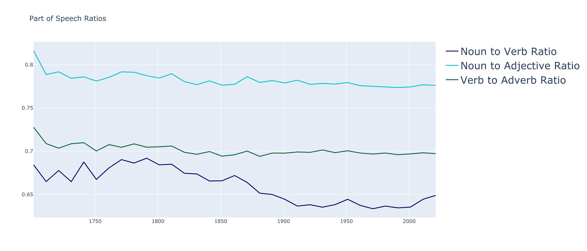
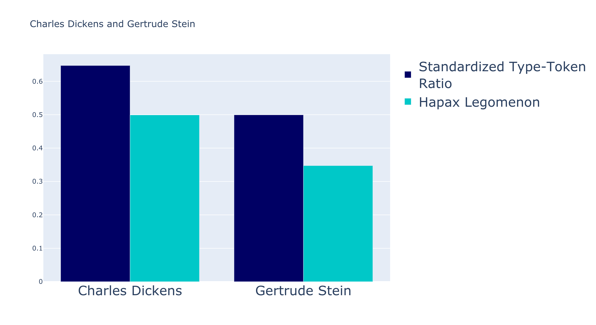
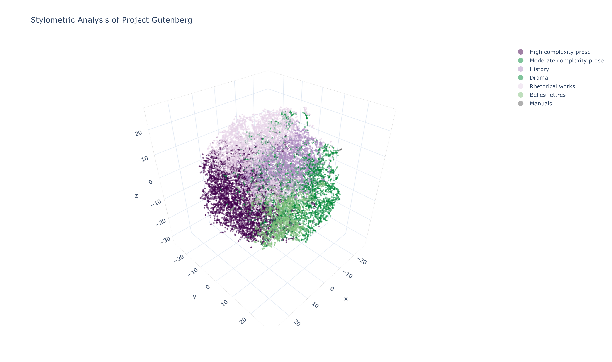

# Stylometric Analysis of Project Gutenberg

## Summary

My goal for this project was to build a recommendation engine for books based on literary style. This is an alternative to  other book recommenders, which are typically based on bibliographic metadata or collaborative filtering through reader ratings. I also sought to cluster all English books in Project Gutenberg into stylistic types. 

I accomplished both these tasks by engineering numerical style metrics for the full text of every English book in Project Gutenberg, approximately 30,000 titles. 

Based on the style metrics, I produced two things:

1. A recommendation engine using cosine similarity between titles
2. An identification of 7 stylistic types in Project Gutenberg using k-means clustering

## Project Gutenberg

Project Gutenberg is a volunteer effort to digitize and archive cultural works, to "encourage the creation and distribution of eBooks.” It was founded in 1971 by American writer Michael S. Hart and is the oldest digital library. Most of the items in its collection are the full texts of public domain books. A majority of the titles were originally published before 1950, as these titles do not fall under copyright protections.

For more information on Project Gutenberg, see [gutenberg.org/](https://www.gutenberg.org/).

## ETL Pipeline

In order to obtain the raw text of all books available on Project Gutenberg, I used [wget](https://www.gnu.org/software/wget/) to scrape a [Project Gutenberg mirror](http://www.gutenberg.org/robot/harvest?filetypes[]=txt&langs[]=en) for all English-language .txt files. 

I obtained about 80,000 files from the mirror. I next needed to do two things. First, I needed to extract the bibliographic metadata such as author, title, and year from each of them. Second, I needed to remove duplicates, keeping the highest quality file.

I wrote a parsing function that dealt with both of these problems simultaneously. I used error handling to quality-filter the files, as many of them were simply of too poor quality to be of use for this project. My parsing function performed regular expression searches across the texts to capture title and author name; if no title or author was found in the file, the function would throw a `KeyError` or `IndexError`, and the loop would continue to the next .txt in the directory.

Additionally, many of the texts were duplicate encodings, and would throw a `UnicodeDecodeError` when I tried to read them in. All filenames throwing this error ended in "-8" or "-0", and there seemed to be ASCII versions of all of them. So they were skipped.

Next, I wanted to add each text's original publication year to its bibligraphic metadata. Because many of the publication dates listed in the files either were missing or did not correspond to that book's _original_ publication date, I used the [wikipedia package](https://pypi.org/project/wikipedia/) to pull each book's original publication year. Through the package's `.summary` method, which wraps the MediaWiki API, I queried each title and performed regex searches on their summaries in order to obtain the year.

I ran the full text of each book was run through a function I defined called `clean_text()`. This purpose of this function was to remove much of the front matter and other extraneous text from the books such as garbage characters, chapter titles, footnotes, linebreaks, information about Project Gutenberg, copyright, etc. I found a helpful [gutenberg package](https://github.com/c-w/gutenberg) online to help with this process. Although I did my best to remove most of this text, due the lack of standardized formatting I was inevitably unable to remove _all_ of it; statistically, though, this should have little impact on the style metrics, as titles, headings, etc. typically only encompass about twenty to thirty words.

I inserted each text's author, title, year, filename, and the full, cleaned text into a MongoDB collection stored locally on a virtual machine accessed via Google Cloud Platform. Files that lacked either author, title, or year were not added to the collection.

## Style Metrics

I engineered 16 style metrics indicative of vocabulary richness, lexical complexity, sentence and word length, part-of-speech ratios, and readibility scores:

**Standardized Type-Token Ratio:** Type-token ratio (TTR) is a measure of vocabulary richness. It is calculated by dividing the number of unique tokens in a document (types) by the total number of tokens in the document. _Standardized_ TTR calculates the running average of TTRs for every 1,000 word window of a document.

**Hapax Legomenon:** This measure is somewhat correlated with the TTR. It measures the percentage of words in a document that are used only once. Like STTR, I calculated the running average for every 1,000 word window of each document. 

**Yule’s K Characteristic:** Yule's K measures the likeihood that two words randomly chosen from the same document will be the same word. 

**Function Words:** This metric is the percentage of a document comprised of function words, including articles, prepositions, and conjunctions. 

**Average Sentence Length in Words:** Including stop words, the average sentence length of a document in word count.

**Average Sentence Length in Characters:** Including stop words, the average sentence length of a document in character count.

**Average Number of Syllables Per Word:** Determined via a function that, where available, references the CMU Pronouncing Dictionary for the number of syllables in a word. When not found in the CMU dictionary, the function calculates the number of syllables manually according to the so-called "written method." I then took the average number of syllables for the whole document. 

**Punctuation Per Sentence:** Counts the number of punctuation characters in a sentence, then takes the average number per sentence for a document. 

**Shannon’s Entropy:** Shannon's Entropy score as a general measure of diversity and readibility. 

**Simpson’s D:** Simpson's Diversity Index as a general measure of diversity and readability.
 
**Number of Noun Phrases:** Calculates the running average number of noun phrases for each 1,000 word window of a document. 

**Noun to Verb Ratio:** N(nouns)/(N(nouns) + N(verbs)); Over .50 indicates noun bias, under .50 indicates verb bias. 

**Noun to Adjective Ratio:** N(nouns)/(N(nouns) + N(adjectives)); Over .50 indicates noun bias, under .50 indicates adjective bias. 

**Verb to Adverb Ratio:** N(verbs)/(N(verbs) + N(adverbs)); Over .50 indicates verb bias, under .50 indicates adverb bias. 

**Average Dependency Distance:** Dependency distance is the linear distance between two syntactically related words in a sentence. This metric takes the average distance between token heads and token children in a sentence, then the averages of the sentence distances for the whole document. 

## Exploratory Data Analysis 

Several of the style metrics showed wide variations throughout the timespan in which the titles in Project Gutenberg were published. For example, average number of syllables per word, average dependency distance, and average sentence length showed marked decrease from the year 1750 to the present. Additionally, Standardized Type-Token Ratio decreased during this time, but to a lesser extent than these others.

By contrast, part-of-speech ratios largely remained stagnant over this timeframe, with the exception of verb-to-adverb ratio, which started to decline near the beginning of the 19th century. 

 

These style metrics were also useful for visualizing the differences between individual author styles. Below, we have two authors: Charles Dickens and Gertrude Stein. Dickens was known for his very rich vocabulary, Stein for her versatility with few words. We can see that Dickens scores much higher than Stein in both STTR, hapax legomenon, and average dependency distance, however their average number of syllables per word is roughly equal.

Two additional authors, Karl Marx and William Shakespeare, who intuitively come from two very different stylistic types, can be quantitatively shown to be stylistically different. Below, we can see that Shakespeare, perhaps surprisingly (being a highly descriptive writer), uses more nouns relative to adjectives than Marx, however Marx's sentences are much, much longer than Shakespeare's.

## Clusters

After using the silhouette method to locate the optimal value for k-means clustering, I identified 7 stylistic types in Project Gutenberg:

1. High complexity prose
 
    • High vocabulary richness, long sentences, many noun phrases, large dependency distances

2. Moderate complexity prose

    • Medium vocabulary richness, shorter sentences, fewer noun phrases

3. History

    • Medium vocabulary richness, long sentences, high noun-to-verb and noun-to-adjective biases

4. Manuals (including dictionaries, reference, technical books, etc.)

    • Low vocabulary richness, short sentences, heavy punctuation usage, high noun-to-verb and noun-to-adjective biases

5. Rhetorical works (including philosophy and political writing)

    • High vocabulary richness, long and complex sentences, high syllable words, heavy punctuation usage, large dependency distances, many function words

6. Belles-lettres (including poetry, verse, and satire)

    • High vocabulary richness, long sentences, high syllable words, few function works

7. Drama (including plays)

    • Low vocabulary richness, high noun biases, short dependency distances, short sentences, light punctuation usage

Belles-lettres has the highest STTR score, followed by rhetorical works and history. Prose is right in the middle.

Surprisingly, rhetorical works uses more adjectives relative to nouns than prose, and drama uses the most nouns relative to adjectives.

Rhethorical works has the largest average number of syllables per word, followed closely by history. 

## Metric Space

I performed dimensionality reduction with t-distributed Stochastic Neighbor Embedding (t-SNE) in order to visualize the stylistic similarity between books in 3-dimensional space. Simply put, t-SNE defines a probability distribution that summarizes the relationships between data-points in high-dimensional space. 

Each marker on the above metric space represents one book in Project Gutenberg. If you open it as an HTML file, as you hover your cursor over a marker, it displays that book's author, title, and publication year. The closest markers to that book represent the most stylistically similar books. The 7 different colors represent the 7 different clusters. 

## Recommendation Engine

Because the scale of each of the style metrics sometimes varies widely, I used two scikit-learn methods for scaling the data. The first was `MinMaxScaler()`, however, because this is non-distorting for standard deviation, I instead settled on using `StandardScaler()` so that the distribution of each metric was a standard normal distribution, with a mean of 0 and a standard deviation of 1. Because I wanted to use cosine similarity as my distance measure, treating the metrics' standard deviations in this way ensures that no one metric is emphasized over the others. 

I built the front-end in [Streamlit](https://www.streamlit.io/). The text input object prompts the user to enter a book title. I used the [fuzzywuzzy package](https://github.com/seatgeek/fuzzywuzzy) in order to fuzzy match the inserted title. Fuzzywuzzy uses Levenschtein distance to find the closest match to the input search. 

After entering a search, the left sidepanel displays the closest match's title, author, year, and cluster. Below is that title's 16 style metrics and the 10 most stylistically similar titles.

## Further Research

I see many potential future applications for this kind of stylometric analysis.

One approach might be to apply this method to new titles and using it to forecast sales. This pipeline could just as easily be applied to new titles had those texts been readily accessible in large numbers. 

Another approach could be to use style metrics for authorship attribution and/or plagiarism detection. 

Moreover, there are numerous additional style metrics that could have been engineered for this project; the only limitation to doing so is time. More granular stylometric analyses could be performed in the future. 